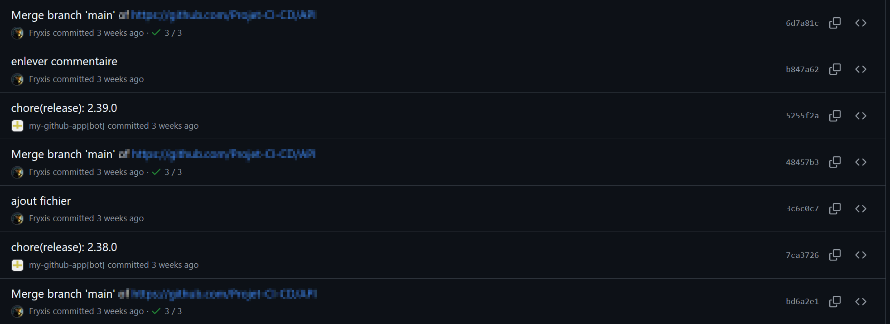
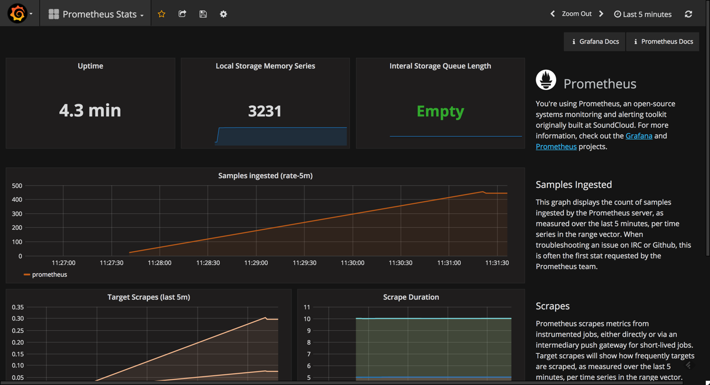
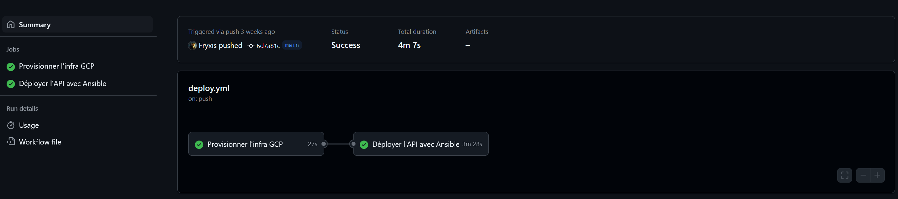

# Documentation CI/CD – Projet DevOps Ynov

## Présentation du projet

### Contexte

Ce projet s'inscrit dans le cadre du développement d’une **API REST** destinée à alimenter une application mobile. L'objectif est de mettre en place une infrastructure CI/CD complète, automatisée, résiliente et documentée, en incluant le déploiement, la supervision, les sauvegardes, le rollback et le versionnement.

### Technologies utilisées

* Infrastructure as Code : **Terraform (GCP)**
* Configuration : **Ansible**
* Pipeline CI/CD : **GitHub Actions**
* API : **Express.js + SQLite**
* Conteneurisation : **Docker**
* Monitoring : **Prometheus + Grafana**
* Gestion des secrets : **GitHub Secrets**
* Versionnement : **SemVer**

---

## GitFlow

### Branches utilisées

* `main` : production
* `develop` : intégration continue
* `feature/*` : nouvelles fonctionnalités
* `release/*` : préparation d’une version stable
* `hotfix/*` : corrections urgentes sur la production

### Captures d’écran à inclure







---

## Pipeline CI/CD

### Fichiers YAML

Chemin : `.github/workflows/deploy.yml`

#### Étapes du pipeline :

1. **Lint** : vérifie la syntaxe du code
2. **Test** : exécute les tests unitaires
3. **Build** : construit l’image Docker
4. **Package** : crée un artefact (image Docker taguée)
5. **Déploiement staging** : push vers l’environnement de test
6. **Déploiement production** : push vers l’environnement final
7. **Snapshot** : snapshot VM ou disque via `gcloud compute disks snapshot`
8. **Rollback** : déclenche une restauration si une étape échoue

---

## Packaging & Versionnement

### SemVer (Semantic Versioning)

Exemples : `v1.0.0`, `v1.1.0`, `v1.1.1`

* `major.minor.patch`

### Outils

* `git tag` pour versionner
* `standard-version` pour automatiser
* Dépôt des artefacts : **GitHub Releases**

---

## Gestion des secrets et environnements

### Méthodologie

* **Secrets sensibles** dans GitHub Secrets
* **Fichiers `.env`** en local (jamais commités)

### Séparation staging/production

* Variables d’environnement propres à chaque env (`.env.staging`, `.env.prod`)
* Actions conditionnelles dans les workflows GitHub (`if: github.ref == 'refs/heads/main'`)

---

## Tests & Logs

### Pipeline CI

* Screenshots de GitHub Actions (tests OK / KO)
* Exemple de log : erreur de build avec explication

---

## Captures obligatoires (avec légende)

* ✅ Exécution complète d’un pipeline GitHub Actions
* ✅ Application déployée en staging (screenshot navigateur)
* ✅ Application en production (capture après push sur main)
* ✅ Historique de commits et tags visibles sur GitHub
* ✅ Dashboard Grafana avec logs/prometheus actifs
* ✅ Déclenchement d’un snapshot (commande + résultat)
* ✅ Démonstration d’un rollback (capture `gcloud` ou script d'exécution)

---

### Déploiement manuel

```bash
git checkout main
git pull origin main
docker compose up -d
```

### Rollback

```bash
gcloud compute disks snapshot rollback-disk --source-snapshot="snapshot-id"
gcloud compute instances attach-disk my-instance --disk=rollback-disk
```

### Plan de versionnage

* Utilisation de `standard-version`
* Commit format : `fix:`, `feat:`, `chore:`
* Génération automatique du changelog

---

## Structure du dépôt Git

```
├── api/                    # Code de l’API
├── terraform/              # Scripts Terraform
├── ansible/                # Rôles et playbooks
├── .github/workflows/      # Workflows CI/CD
├── monitoring/             # Dashboards, configs Prometheus/Grafana
├── rollback/               # Script ou doc de rollback
├── snapshots/              # Config snapshots GCP
├── tags/                   # Versions SemVer
├── .git/                   # Historique Git (non affiché sur GitHub)
└── README.md               # Ce fichier
```
## 🔐 Sauvegarde & 🔄 Rollback

### 🗄️ Stratégie de sauvegarde

Afin de garantir une résilience maximale de l’infrastructure, une **sauvegarde automatique** est effectuée à l’aide de **snapshots GCP**. Cette opération est déclenchée **automatiquement après chaque déploiement réussi** via GitHub Actions.

#### 🔧 Outils & Méthode

- **Commande utilisée** : `gcloud compute disks snapshot`
- **Ressource ciblée** : disque persistant principal (`vm-disk`) de la VM hébergeant l’API
- **Nom du snapshot** : `snapshot-api-<timestamp>` (ex : `snapshot-api-20250611-130201`)
- **Zone** : `europe-west9-b`
- **Déclenchement** : à la fin du job `ansible` dans le pipeline CI/CD
- **Authentification** : via clé de compte de service GCP encodée en base64, stockée dans `secrets.GCP_CREDENTIALS`

#### 📄 Extrait GitHub Actions

```yaml
- name: Créer un snapshot du disque
  run: |
    TIMESTAMP=$(date +%Y%m%d-%H%M%S)
    gcloud compute disks snapshot vm-disk \
      --snapshot-names=snapshot-api-$TIMESTAMP \
      --zone=europe-west9-b \
      --project=${{ secrets.GCP_PROJECT_ID }}
```
## 🔄 Stratégie de rollback

Le rollback permet de **restaurer un état fonctionnel connu** à partir d’un snapshot en cas d’échec du déploiement.

### ✅ Déclenchement conditionnel

Un job `rollback` est automatiquement exécuté dans GitHub Actions si le job `ansible` échoue :

```yaml
if: ${{ failure() }}
```

## 🔄 Stratégie de rollback

Le rollback permet de **restaurer un état fonctionnel connu** à partir d’un snapshot en cas d’échec du déploiement.

---

### 🔁 Étapes de restauration

1. **Détacher le disque corrompu**
2. **Supprimer l’ancien disque**
3. **Recréer un disque depuis le snapshot**
4. **Réattacher le disque à la VM**

---

### 🖥️ Script utilisé (GitHub Actions ou manuel)

```bash
gcloud compute instances detach-disk my-vm --disk=vm-disk --zone=europe-west9-b
gcloud compute disks delete vm-disk --zone=europe-west9-b --quiet
gcloud compute disks create vm-disk \
  --source-snapshot=snapshot-api-<TIMESTAMP> \
  --zone=europe-west9-b
gcloud compute instances attach-disk my-vm --disk=vm-disk --zone=europe-west9-b
```

### 📂 Fichiers associés

- `rollback/restore_from_snapshot.sh` : script shell de restauration manuelle
- `snapshots/` : documentation et informations sur les snapshots générés
- `.github/workflows/deploy.yml` : pipeline avec gestion `snapshot` + `rollback`

---

## 📈 Supervision & Monitoring

### 🧩 Outil utilisé : Uptime Kuma

Pour assurer un suivi de disponibilité de l’API déployée, l’outil **Uptime Kuma** a été intégré à l’infrastructure.

Uptime Kuma est un moniteur de disponibilité auto-hébergé, comparable à UptimeRobot, permettant de surveiller des services HTTP(s), ping, TCP, etc., avec alertes configurables.

---

### ⚙️ Configuration mise en place

- **Déploiement** : conteneur Docker dédié sur un hôte de supervision
- **Moniteur actif** : `GET https://<mon-api>/health` (endpoint de santé de l'API)
- **Méthode** : requête HTTP toutes les 30 secondes
- **Alerte en cas d’échec** : notification visuelle dans l’interface + e-mail (ou autre service configurable)
- **Historique** : taux de disponibilité journalier, hebdomadaire, mensuel

---

### 🎯 Objectifs assurés par Kuma

- ✅ Détection immédiate des interruptions de service
- ✅ Validation du succès post-déploiement (auto-test)
- ✅ Historique utile pour la démonstration de la fiabilité de l’API

---

### 🖼️ Capture d’écran à inclure

| Élément              | Description                              |
|----------------------|------------------------------------------|
| 🟢 Statut en ligne   | Vue du moniteur actif avec "Up" visible  |
| 🔴 Simulation d’erreur | Capture en cas d’erreur simulée ou réelle |
| 📊 Historique         | Graphique de disponibilité sur 24h/7j     |

---

### 📂 Fichier associé

- `monitoring/uptime-kuma-config.json` : export de la configuration (optionnel)
