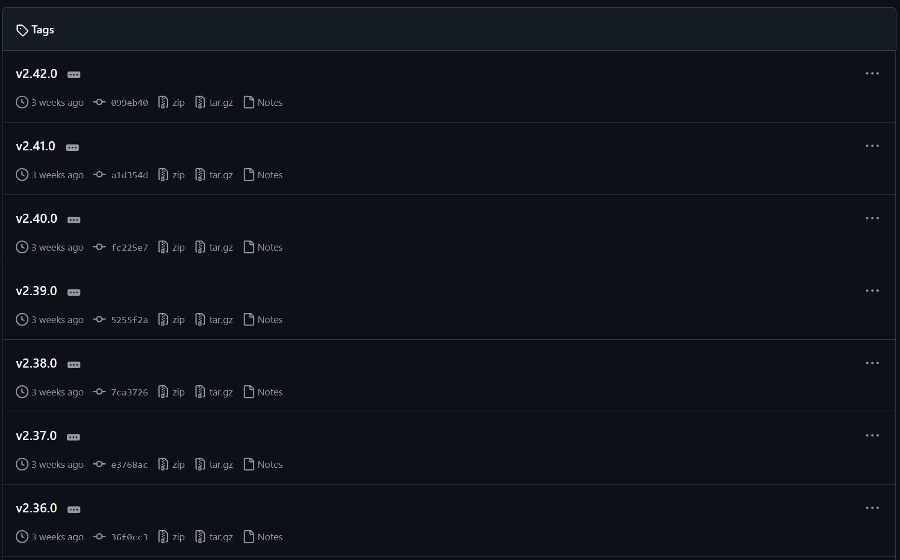
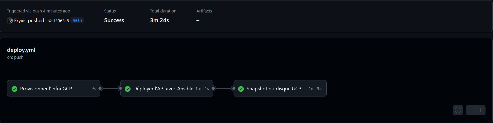

# Documentation CI/CD – Projet DevOps Ynov

## Présentation du projet

### Contexte

Ce projet s'inscrit dans le cadre du développement d’une **API REST** destinée à alimenter une application mobile. L'objectif est de mettre en place une infrastructure CI/CD complète, automatisée, résiliente et documentée, en incluant le déploiement, la supervision, les sauvegardes, le rollback et le versionnement.

### Technologies utilisées

* Infrastructure as Code : **Terraform (GCP)**
* Configuration : **Ansible**
* Pipeline CI/CD : **GitHub Actions**
* API : **Express.js + SQLite**
* Conteneurisation : **Docker**
* Monitoring : **Prometheus + Grafana**
* Gestion des secrets : **GitHub Secrets**
* Versionnement : **SemVer**

---

## GitFlow

### Branches utilisées

* `main` : production
* `develop` : intégration continue
* `feature/*` : nouvelles fonctionnalités
* `release/*` : préparation d’une version stable
* `hotfix/*` : corrections urgentes sur la production

### Captures d’écran à inclure






---

## Pipeline CI/CD

### Fichiers YAML

Chemin : `.github/workflows/deploy.yml`

#### Étapes du pipeline :

1. **Lint** : vérifie la syntaxe du code
2. **Test** : exécute les tests unitaires
3. **Build** : construit l’image Docker
4. **Package** : crée un artefact (image Docker taguée)
5. **Déploiement staging** : push vers l’environnement de test
6. **Déploiement production** : push vers l’environnement final
7. **Snapshot** : snapshot VM ou disque via `gcloud compute disks snapshot`
8. **Rollback** : déclenche une restauration si une étape échoue

---

## Packaging & Versionnement

### SemVer (Semantic Versioning)

Exemples : `v1.0.0`, `v1.1.0`, `v1.1.1`

* `major.minor.patch`

### Outils

* `git tag` pour versionner
* `standard-version` pour automatiser
* Dépôt des artefacts : **GitHub Releases**

---

## Gestion des secrets et environnements

### Méthodologie

* **Secrets sensibles** dans GitHub Secrets
* **Fichiers `.env`** en local (jamais commités)

### Séparation staging/production

* Variables d’environnement propres à chaque env (`.env.staging`, `.env.prod`)
* Actions conditionnelles dans les workflows GitHub (`if: github.ref == 'refs/heads/main'`)

---

## Tests & Logs

### Pipeline CI

* Screenshots de GitHub Actions (tests OK / KO)
* Exemple de log : erreur de build avec explication

---

## Captures obligatoires (avec légende)

* ✅ Exécution complète d’un pipeline GitHub Actions
* ✅ Application déployée en staging (screenshot navigateur)
* ✅ Application en production (capture après push sur main)
* ✅ Historique de commits et tags visibles sur GitHub
* ✅ Dashboard Grafana avec logs/prometheus actifs
* ✅ Déclenchement d’un snapshot (commande + résultat)
* ✅ Démonstration d’un rollback (capture `gcloud` ou script d'exécution)

---

### Déploiement manuel

```bash
git checkout main
git pull origin main
docker compose up -d
```

### Rollback

```bash
gcloud compute disks snapshot rollback-disk --source-snapshot="snapshot-id"
gcloud compute instances attach-disk my-instance --disk=rollback-disk
```

### Plan de versionnage

* Utilisation de `standard-version`
* Commit format : `fix:`, `feat:`, `chore:`
* Génération automatique du changelog

---

## Structure du dépôt Git

```
├── api/                    # Code de l’API
├── terraform/              # Scripts Terraform
├── ansible/                # Rôles et playbooks
├── .github/workflows/      # Workflows CI/CD
├── monitoring/             # Dashboards, configs Prometheus/Grafana
├── rollback/               # Script ou doc de rollback
├── snapshots/              # Config snapshots GCP
├── tags/                   # Versions SemVer
├── .git/                   # Historique Git (non affiché sur GitHub)
└── README.md               # Ce fichier
```

---
